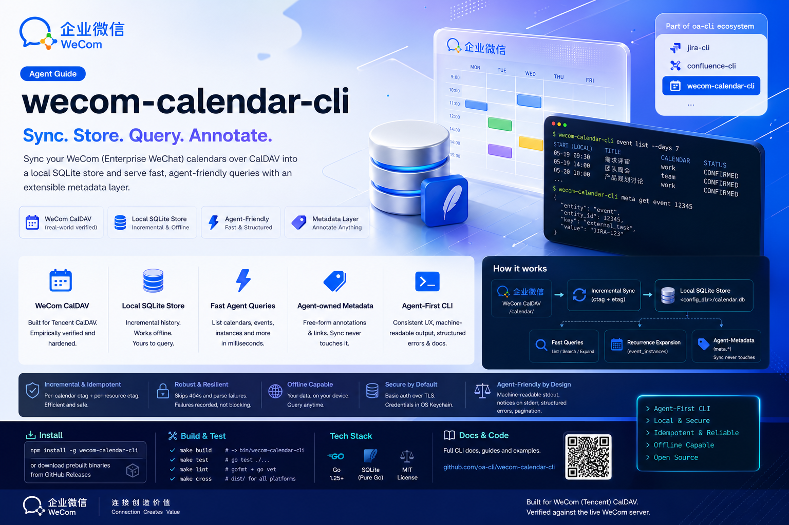

# wecom-calendar-cli

[](https://github.com/angelmsger/wecom-calendar-cli/actions/workflows/ci.yml)
[](https://www.npmjs.com/package/@angelmsger/wecom-calendar-cli)
[](go.mod)
[](LICENSE)
[](https://angelmsger.github.io/wecom-calendar-cli/)

> Sync your WeCom calendars into a local store and query them from your terminal — built for coding agents.

`wecom-calendar-cli` lets coding agents (Claude Code and others) — and humans —
keep a **local SQLite mirror** of a user's WeCom (Enterprise WeChat) calendars,
synced over CalDAV, then query events and calendars from it and maintain a
**free-form, agent-owned metadata layer** (event classification, links to
external tasks). It returns agent-friendly JSON with structured errors, and
ships a companion Skill that teaches an agent how to use it. The metadata layer
is never touched by sync, so annotations survive every refresh. The only writes
(`meta set` / `meta delete`) support `--dry-run` and a session read-only posture.

📖 **Documentation site:** <https://angelmsger.github.io/wecom-calendar-cli/>



> **The WeCom app-password caveat.** Auth is HTTP Basic — your full WeCom email
> as the username and an **app-specific CalDAV password** as the secret (not
> your normal login password). Get it in the WeCom **mobile app**: Workbench →
> Calendar → settings → **Sync to other calendars**. Fetching a new password
> there **invalidates the previous one**, so if a working setup starts returning
> 401, re-issue and re-configure.

## Features

- **Local store, queried offline** — `sync` pulls CalDAV changes into SQLite
  incrementally (per-calendar change-tags) and idempotently; every query reads
  the store, so it is fast and works offline. Reads emit a stale notice when the
  store falls behind.
- **Agent-owned metadata** — attach free-form annotations to events by UID:
  namespaces / keys / JSON values for classification or external task links.
  `sync` never writes or deletes them, so they survive every re-sync.
- **Agent-friendly** — JSON output by default, structured errors with exit
  codes and recovery hints, `{items, next, has_more}` pagination, and `--fields`
  projection so an agent spends minimal context.
- **WeCom CalDAV quirks handled** — the non-standard Tencent CalDAV backend
  (bare `/calendar/` home, per-`.ics` GET bodies, non-IANA embedded TZIDs) is
  handled for you.
- **Companion Skill** — a `wecom-calendar` Skill, embedded in the binary, that
  guides coding agents through the CLI.

## Installation

Install the CLI with npm, then take two short steps to finish setup — deploy
the companion Skill, then (optionally) enable shell completion.

### 1. Install the CLI — npm (recommended)

```bash
npm install -g @angelmsger/wecom-calendar-cli
```

npm downloads the prebuilt binary for your platform, verifies its SHA-256
checksum, and keeps upgrades one `npm update -g @angelmsger/wecom-calendar-cli`
away.

<details>
<summary><strong>Other install methods</strong> — go install, source build, prebuilt binary</summary>

```bash
go install github.com/angelmsger/wecom-calendar-cli/cmd/wecom-calendar-cli@latest   # go 1.25+
make install                                                                        # from a source checkout
```

Or download a prebuilt binary from the
[Releases page](https://github.com/angelmsger/wecom-calendar-cli/releases).

</details>

### 2. Deploy the companion Skill

The `wecom-calendar` Skill is embedded in the binary; it teaches your coding
agent (**Claude Code**, **Codex**) how to drive the CLI. `skill install` probes
for installed agents and installs into each one found:

```bash
wecom-calendar-cli skill install            # auto-detect; install for each agent found
wecom-calendar-cli skill install --agent codex
wecom-calendar-cli skill uninstall          # remove it again
```

Re-run it after upgrading the CLI to keep the Skill version-matched.

### 3. Enable shell completion (optional)

`wecom-calendar-cli` completes subcommands, enum flag values and live calendar
ids. Load the completion script for your shell once:

```bash
source <(wecom-calendar-cli completion bash)                            # bash, current shell
wecom-calendar-cli completion zsh > "${fpath[1]}/_wecom-calendar-cli"   # zsh, persistent
```

## Quick start

```bash
wecom-calendar-cli config init   # CalDAV server URL + WeCom email + app password
wecom-calendar-cli doctor        # verify configuration, credentials, connectivity

wecom-calendar-cli sync                                              # pull into the local store
wecom-calendar-cli calendar list                                    # what landed
wecom-calendar-cli event list --since 2026-07-01 --until 2026-07-31  # query a window

# annotate an event (uid comes from an `event list` item) and link it to a task
wecom-calendar-cli meta set <uid> task feishu_project "6949886165" --source agent
wecom-calendar-cli meta get <uid>
```

Every query reads the **local store**, not the server — run `sync` first, and
re-sync when a read prints a `_notice.stale` line on stderr.

## Configuration

Settings resolve in precedence order (highest first): CLI flags → environment
variables (`WECOM_CALENDAR_*`) → `.env` → `~/.angelmsger/wecom-calendar/config.yaml`
→ defaults. See `.env.example`. Secrets are stored in the OS keychain (per-user
DPAPI fallback on Windows, a `0600` file fallback on macOS/Linux) — never in the
config file. The SQLite database lives next to `config.yaml` at
`<config_dir>/calendar.db` and moves with `--config`; it may hold personal
calendar data and is never committed.

## Commands

| Command | Purpose |
|---------|---------|
| `sync` | pull CalDAV changes into the local store (incremental; `--full`, `--calendar`, `--dry-run`) |
| `calendar list` | list calendars from the store (`--refresh` re-lists from the server) |
| `event list` | query events in a `--since`/`--until` window (`--calendar`, `--limit`) |
| `meta set` / `get` / `list` / `delete` | maintain the agent-owned metadata layer, keyed by event UID |
| `config` / `auth` / `doctor` | setup, credentials and diagnostics |
| `config get-contexts` / `use-context` / `delete-context` | manage multiple named servers |
| `skill install` / `skill uninstall` | deploy or remove the embedded companion Skill (Claude Code, Codex) |
| `version` / `completion` | build info and shell completion |

In the default JSON output, list commands return a `{items, next, has_more}`
envelope; pass `--cursor` with a prior page's `next` to read the following page,
or `--all` to fetch every page. `--format ndjson` instead streams the items
themselves, one JSON object per line.

## The local store

Unlike the sibling CLIs — stateless wrappers over a remote API — this one is
**stateful**: it maintains a local SQLite store so history is queryable offline
and annotatable. `sync` is the only path that writes synced facts (raw events,
soft-delete tombstones, derived instances); the **`event_metadata` layer is
agent-owned and never written or deleted by sync**. Deleting an event on the
server soft-deletes its row but leaves its metadata resolvable by UID.

## Safety modes

The only writes are `meta set` and `meta delete`. Both accept `--dry-run`
(preview without applying) and honor a session read-only posture
(`defaults.read_only` / `WECOM_CALENDAR_CLI_READ_ONLY=1`, overridable per
invocation with `--allow-writes`). `meta delete` is destructive, so applying it
also requires `--yes` (or an interactive confirmation); a non-interactive caller
must pass `--yes`. `sync` is a read against the server and a write to the store's
synced facts only — it is not blocked by read-only mode and never touches
metadata.

## Errors and exit codes

Failures are JSON on **stderr** (stdout stays a clean data channel) and map to
stable exit codes: `0` success, `2` usage, `3` config, `4` auth, `5` permission,
`6` not found, `7` rate limit, `8` network, `9` server, `10` parse, `11`
conflict. Each error carries `next_steps` naming the command to run next, and
`retryable` to guide back-off.

## Development

```bash
make build      # -> bin/wecom-calendar-cli
make test       # unit tests
make lint       # gofmt + go vet
make cross      # cross-compile dist/ for all platforms
make docs       # regenerate the CLI reference under docs/cli/
```

The [`docs/cli/`](docs/cli/) reference is generated from the cobra command tree
by `cmd/gen-docs`, so it always matches `--help`. After changing a command or
flag, run `make docs` and commit the result — CI fails if it drifts. See
[AGENTS.md](AGENTS.md) for the architecture and `internal/` package layout,
[docs/releasing.md](docs/releasing.md) for the release and npm trusted-publishing
process, and [CHANGELOG.md](CHANGELOG.md) for the version history.

## Related

Part of a family of agent-facing CLIs — one skeleton, one set of conventions, all
built for coding agents. Browse the full set at
**[github.com/AngelMsger](https://github.com/AngelMsger)**:

- **[jira-cli](https://github.com/AngelMsger/jira-cli)** — Jira issues & workflow transitions
- **[confluence-cli](https://github.com/AngelMsger/confluence-cli)** — Confluence as a knowledge base
- **[bitbucket-cli](https://github.com/AngelMsger/bitbucket-cli)** — Bitbucket pull requests & code review
- **[openobserve-cli](https://github.com/AngelMsger/openobserve-cli)** — OpenObserve logs, metrics & traces
- **[jenkins-cli](https://github.com/AngelMsger/jenkins-cli)** — inspect Jenkins jobs & builds
- **wecom-calendar-cli** — WeCom calendars, synced locally & annotated *(this project)*

## License

Released under the [MIT License](LICENSE).
