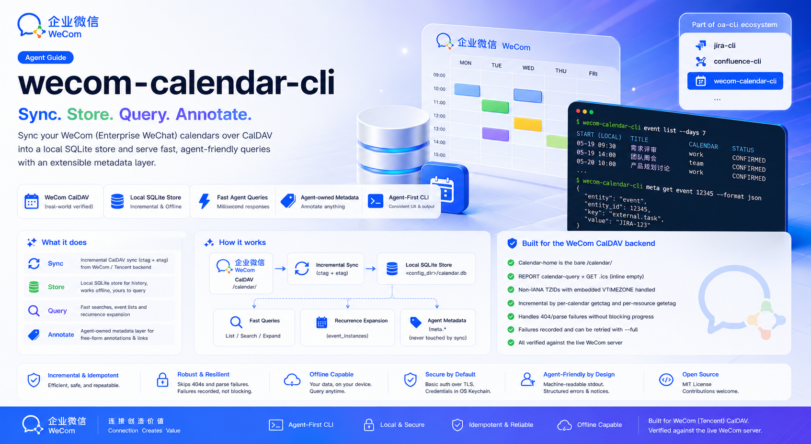

# wecom-calendar-cli

[](https://github.com/angelmsger/wecom-calendar-cli/actions/workflows/ci.yml)
[](https://www.npmjs.com/package/@angelmsger/wecom-calendar-cli)
[](go.mod)
[](LICENSE)
[](https://angelmsger.github.io/wecom-calendar-cli/)

> Sync your WeCom calendars into a local store and query them from your terminal — built for coding agents.

`wecom-calendar-cli` lets coding agents (Claude Code and others) — and humans —
keep a **local SQLite mirror** of a user's WeCom (Enterprise WeChat) calendars,
synced over CalDAV, then query events and calendars from it and maintain a
**free-form, agent-owned metadata layer** (event classification, links to
external tasks). It returns agent-friendly JSON with structured errors, and
ships a companion Skill that teaches an agent how to use it. The metadata layer
is never touched by sync, so annotations survive every refresh. The only writes
(`meta set` / `meta delete`) support `--dry-run` and a session read-only posture.

It complements Tencent's official
[`wecom-cli`](https://github.com/WecomTeam/wecom-cli): use that to create and
change events, and this to read your whole calendar history offline — the
official CLI lists events only within 30 days before or after today. See
[Alongside the official wecom-cli](#alongside-the-official-wecom-cli).

📖 **Documentation site:** <https://angelmsger.github.io/wecom-calendar-cli/>



> **The WeCom app-password caveat.** Auth is HTTP Basic — your full WeCom email
> as the username and an **app-specific CalDAV password** as the secret (not
> your normal login password). Get it in the WeCom **mobile app**: Workbench →
> Calendar → settings → **Sync to other calendars**. Fetching a new password
> there **invalidates the previous one**, so if a working setup starts returning
> 401, re-issue and re-configure.

## Features

- **Local store, queried offline** — `sync` pulls CalDAV changes into SQLite
  incrementally (per-calendar change-tags) and idempotently; every query reads
  the store, so it is fast and works offline. Reads emit a stale notice when the
  store falls behind.
- **Full calendar history** — the mirror holds your full
  event history as well as what is scheduled ahead, so a query reaches last
  quarter or last year as easily as next week.
- **Agent-owned metadata** — attach free-form annotations to events by UID:
  namespaces / keys / JSON values for classification or external task links.
  `sync` never writes or deletes them, so they survive every re-sync.
- **Agent-friendly** — JSON output by default, structured errors with exit
  codes and recovery hints, `{items, next, has_more}` pagination, and `--fields`
  projection so an agent spends minimal context.
- **WeCom CalDAV quirks handled** — the non-standard Tencent CalDAV backend
  (bare `/calendar/` home, per-`.ics` GET bodies, non-IANA embedded TZIDs) is
  handled for you.
- **Companion Skill** — a `wecom-calendar` Skill, embedded in the binary, that
  guides coding agents through the CLI.

## Alongside the official wecom-cli

Tencent ships an official WeCom command-line tool,
[`wecom-cli`](https://github.com/WecomTeam/wecom-cli) (`@wecom/cli`), which also
covers calendars. The two tools overlap only in reading events and are
otherwise built for different jobs, so they work best installed side by side.

The official CLI works live against WeCom's own service, which makes it the
tool for acting on a calendar. Its schedule listing, however, reaches only 30
days before or after today. Events outside that range remain on your calendar
and in the WeCom client; `wecom-cli` just does not list them.

`wecom-calendar-cli` reads through CalDAV instead — the endpoint WeCom provides
for syncing a calendar into other calendar apps — which has no such limit.
`sync` mirrors every event from 2000 onward into a local SQLite store, so last
quarter's review meetings or a kickoff from last year are one `event list`
away.

| | `wecom-calendar-cli` | Official `wecom-cli` |
|---|---|---|
| Maintained by | An independent open-source project | Tencent |
| Covers | Calendars only | Calendars, plus the rest of WeCom: messages, email, documents, todos, meetings and more |
| Reaches WeCom through | CalDAV, the calendar-sync endpoint | WeCom's official service |
| Readable date range | Everything CalDAV serves, from 2000 through two years ahead | 30 days before or after today |
| Where a query runs | A local SQLite mirror — offline and fast, as fresh as the last `sync` | Live against the server on every call |
| Changes to your calendar | None; it is read-only towards WeCom | Create, update and cancel events; manage attendees |
| Availability across members | — | Free/busy lookup |
| Your own annotations | An agent-owned `meta` layer that survives every sync | — |
| Signs in with | Your WeCom email and an app-specific CalDAV password | Credentials configured by `wecom-cli init` |

Checked against wecom-cli 1.3.2 on 2026-10-05.

Recurring events are expanded from two years back to one year ahead by default.
To query them further out, widen the window once with
`wecom-calendar-cli expand --from <date> --to <date>`; later syncs keep it.

In practice, reach for `wecom-cli` to change something or to work with the rest
of WeCom, and for `wecom-calendar-cli` to look back, query offline, and
annotate.

This repository was archived from 2026-08-19 to 2026-10-05 on the assumption
that the official CLI replaced it. Daily use exposed the limit above, and
active maintenance resumed.

## Installation

Install the CLI with npm, then take two short steps to finish setup — deploy
the companion Skill, then (optionally) enable shell completion.

### 1. Install the CLI — npm (recommended)

```bash
npm install -g @angelmsger/wecom-calendar-cli
```

npm downloads the prebuilt binary for your platform, verifies its SHA-256
checksum, and keeps upgrades one `npm update -g @angelmsger/wecom-calendar-cli`
away.

<details>
<summary><strong>Other install methods</strong> — go install, source build, prebuilt binary</summary>

```bash
go install github.com/angelmsger/wecom-calendar-cli/cmd/wecom-calendar-cli@latest   # go 1.25+
make install                                                                        # from a source checkout
```

Or download a prebuilt binary from the
[Releases page](https://github.com/angelmsger/wecom-calendar-cli/releases).

</details>

### 2. Deploy the companion Skill

The `wecom-calendar` Skill is embedded in the binary; it teaches your coding
agent (**Claude Code**, **Codex**, **Cursor**, **Agents** (shared), **Gemini CLI**, **GitHub Copilot**, **OpenCode**, **Continue**, **Windsurf**, **Grok Build**, **Pi**, **Kilo Code**, and **Roo Code**) how to drive the CLI. `skill install` probes
for installed agents and installs into each one found:

```bash
wecom-calendar-cli skill install            # auto-detect; install for each agent found
wecom-calendar-cli skill install --agent codex
wecom-calendar-cli skill status             # compare loaded, installed, embedded versions
wecom-calendar-cli skill uninstall          # remove it again
```

After upgrading the CLI, re-run `skill install` and reload the agent context.
The package manager does not replace a deployed copy; `skill status` and
`doctor` report when the loaded or installed Skill no longer matches the
binary, and update notices list the same steps in order.

### 3. Enable shell completion (optional)

`wecom-calendar-cli` completes subcommands, enum flag values and live calendar
ids. Load the completion script for your shell once:

```bash
source <(wecom-calendar-cli completion bash)                            # bash, current shell
wecom-calendar-cli completion zsh > "${fpath[1]}/_wecom-calendar-cli"   # zsh, persistent
```

## Quick start

```bash
wecom-calendar-cli config init   # CalDAV server URL + WeCom email + app password
wecom-calendar-cli doctor        # verify configuration, credentials, connectivity

wecom-calendar-cli sync                                              # pull into the local store
wecom-calendar-cli calendar list                                    # what landed
wecom-calendar-cli event list --from 2026-07-01 --to 2026-08-01      # query a window
wecom-calendar-cli event list --from now --to now+14d                # or look ahead

# annotate an event (uid comes from an `event list` item) and link it to a task
wecom-calendar-cli meta set <uid> task feishu_project "6949886165" --source agent
wecom-calendar-cli meta get <uid>
```

Every query reads the **local store**, not the server — run `sync` first, and
re-sync when a read prints a `_notice.stale` line on stderr.

## Configuration

Settings resolve in precedence order (highest first): CLI flags → environment
variables (`WECOM_CALENDAR_*`) → `.env` → `~/.angelmsger/wecom-calendar/config.yaml`
→ defaults. See `.env.example`. Secrets are stored in the OS keychain (per-user
DPAPI fallback on Windows, a `0600` file fallback on macOS/Linux) — never in the
config file. The SQLite database lives next to `config.yaml` at
`<config_dir>/calendar.db` and moves with `--config`; it may hold personal
calendar data and is never committed.

## Commands

| Command | Purpose |
|---------|---------|
| `sync` | pull CalDAV changes into the local store (incremental; `--full`, `--calendar`, `--dry-run`) |
| `calendar list` | list calendars from the store (`--refresh` re-lists from the server) |
| `event list` | query events in a `--from`/`--to` window, or look back with `--since 7d` (`--calendar`, `--limit`); see [Time windows](#time-windows) |
| `event get` | read one event in full by UID: description, location, organizer and attendees (`--occurrence`, `--include-meta`) |
| `expand` | rebuild recurring-event occurrences; `--from`/`--to` widen the expansion window and pin it for later syncs |
| `meta set` / `get` / `list` / `delete` | maintain the agent-owned metadata layer, keyed by event UID |
| `whoami` | show the configured account, the identity attendee lists flag as `is_self` |
| `config` / `auth` / `doctor` | setup, credentials and diagnostics |
| `config get-contexts` / `use-context` / `delete-context` | manage multiple named servers |
| `skill install` / `skill uninstall` | deploy or remove the embedded companion Skill (Claude Code, Codex, Cursor, Agents, Gemini, GitHub Copilot, OpenCode, Continue, Windsurf, Grok Build, Pi, Kilo Code, Roo Code) |
| `skill status` / `skill path` | compare the loaded, installed and embedded Skill versions, and list install locations |
| `version` / `completion` | build info and shell completion |

In the default JSON output, list commands return a `{items, next, has_more}`
envelope; pass `--cursor` with a prior page's `next` to read the following page,
or `--all` to fetch every page. `--format ndjson` instead streams the items
themselves on stdout, one JSON object per line, and reports a further page on
stderr as `{"_notice":{"pagination":{"next":…,"has_more":true},…}}` — keep
stderr when you page NDJSON.

### Time windows

`event list` follows the time-window vocabulary of its sibling CLIs:
`--since <duration>` looks back from now (`24h`, `7d`), `--from` is an inclusive
lower bound and `--to` an exclusive upper bound. `--since` cannot be combined
with `--from`/`--to`, and `--to` requires `--from`. Because a calendar looks
ahead, three things differ from the siblings:

- A bound may lie in the future, and `now+14d` is a valid instant:
  `--from now --to now+14d`.
- With no window flag the window is 30 days either side of today, on local day
  boundaries; with `--from` alone it ends 30 days ahead rather than now.
- A date such as `2026-07-01` means midnight in the display timezone
  (Asia/Shanghai), not UTC. An RFC 3339 instant with an offset is exact.

A cursor needs fixed bounds, so page with absolute `--from`/`--to`. A window
relative to the current time (`--since`, `now±duration`) is rejected with
`--cursor`; read it in one call with `--all`.

`--until`, and `--since` with a date, are deprecated aliases of `--to` and
`--from` on both `event list` and `expand`. They keep working and print a
`{"_notice":{"deprecated_flag":{…}}}` line on stderr; set
`WECOM_CALENDAR_CLI_NO_DEPRECATION_NOTICE=1` to silence it.

## The local store

Unlike the sibling CLIs — stateless wrappers over a remote API — this one is
**stateful**: it maintains a local SQLite store so history is queryable offline
and annotatable. `sync` is the only path that writes synced facts (raw events,
soft-delete tombstones, derived instances); the **`event_metadata` layer is
agent-owned and never written or deleted by sync**. Deleting an event on the
server soft-deletes its row but leaves its metadata resolvable by UID.

## Safety modes

The only writes are `meta set` and `meta delete`. Both accept `--dry-run`
(preview without applying) and honor a session read-only posture
(`defaults.read_only` / `WECOM_CALENDAR_CLI_READ_ONLY=1`, overridable per
invocation with `--allow-writes`). `meta delete` is destructive, so applying it
also requires `--yes` (or an interactive confirmation); a non-interactive caller
must pass `--yes`. `sync` is a read against the server and a write to the store's
synced facts only — it is not blocked by read-only mode and never touches
metadata.

## Errors and exit codes

Failures are JSON on **stderr** (stdout stays a clean data channel) and map to
stable exit codes: `0` success, `2` usage, `3` config, `4` auth, `5` permission,
`6` not found, `7` rate limit, `8` network, `9` server, `10` parse, `11`
conflict. Each error carries `next_steps` naming the command to run next, and
`retryable` to guide safe retries. A metadata write can be committed before its
result fails to print: `WRITE_SUCCEEDED_OUTPUT_FAILED` preserves the entry's
`(uid, namespace, key)` and a read-only `meta get` recovery command with
`retryable: false`. Every other `meta` write failure happens before the change
is applied, so a local write never has an unknown outcome.

## Development

```bash
make build      # -> bin/wecom-calendar-cli
make test       # unit tests
make lint       # gofmt + go vet
make cross      # cross-compile dist/ for all platforms
make docs       # regenerate the CLI reference under docs/cli/
```

The [`docs/cli/`](docs/cli/) reference is generated from the cobra command tree
by `cmd/gen-docs`, so it always matches `--help`. After changing a command or
flag, run `make docs` and commit the result — CI fails if it drifts. See
[AGENTS.md](AGENTS.md) for the architecture and `internal/` package layout,
[docs/releasing.md](docs/releasing.md) for the release and npm trusted-publishing
process, and [CHANGELOG.md](CHANGELOG.md) for the version history.

## Related

Part of a family of agent-facing CLIs — one skeleton, one set of conventions, all
built for coding agents. Browse the full set at
**[github.com/AngelMsger](https://github.com/AngelMsger)**:

- **[jira-cli](https://github.com/AngelMsger/jira-cli)** — Jira issues & workflow transitions
- **[confluence-cli](https://github.com/AngelMsger/confluence-cli)** — Confluence as a knowledge base
- **[bitbucket-cli](https://github.com/AngelMsger/bitbucket-cli)** — Bitbucket pull requests & code review
- **[openobserve-cli](https://github.com/AngelMsger/openobserve-cli)** — OpenObserve logs, metrics & traces
- **[jenkins-cli](https://github.com/AngelMsger/jenkins-cli)** — inspect Jenkins jobs & builds
- **[prometheus-cli](https://github.com/AngelMsger/prometheus-cli)** — Prometheus queries, targets, rules & alerts
- **wecom-calendar-cli** — WeCom calendars, synced locally & annotated *(this project)*

## License

Released under the [MIT License](LICENSE).
